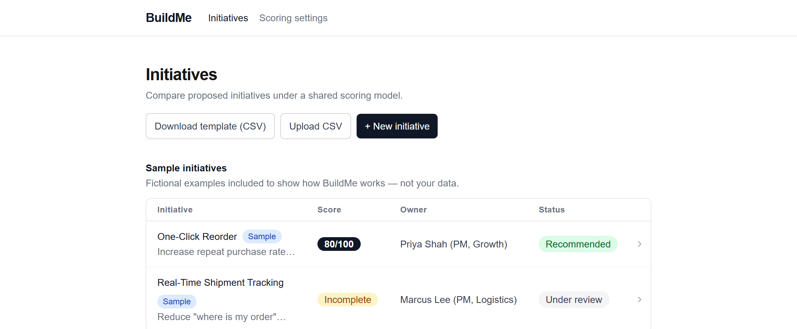

# BuildMe

BuildMe helps a product manager compare proposed initiatives using a shared, configurable scoring model and supporting evidence. This is the Sprint 1 build: a local, single-user prototype with no backend, accounts, or deployment — everything is saved in your browser.



## What's built

- **Initiative list** — a table of initiatives with Score, Owner and Status, ranked highest-first, split into "Your initiatives" and "Sample initiatives" (two clearly labeled fictional examples included out of the box).
- **Create, edit and delete initiatives** — a form for the problem/opportunity, proposed solution, owning team, strategic objective, KPI affected and expected KPI outcome. Deleting asks for confirmation and names the initiative; a deleted initiative's URL shows a friendly not-found page; deleting everything shows a friendly empty state.
- **Assessment and scoring** — rate each initiative 0–5 against two themes, Outcome Impact (60% of the score) and Feasibility (40%), each with two criteria. A criterion left unrated counts as unassessed, not zero — the score only appears once every criterion has a rating. Ratings can be entered at creation time or edited live on the detail page, with the score recalculating immediately.
- **CSV bulk import** — download a CSV template (pre-filled with the current scoring criteria as columns) and upload it to create several initiatives at once, with clear feedback on how many were imported and any rows that had issues.
- **Persistence** — everything is saved to your browser's `localStorage` and survives a reload or fully closing and reopening the browser.
- **Responsive layout** — usable on both a laptop and a phone-width screen.

Not yet built: the Scoring Settings page (adding/editing themes, criteria and weights) is still a placeholder — the scoring model is currently fixed.

## Stack

Next.js (App Router), TypeScript, Tailwind CSS. No backend, database or external services.

## Running it locally

Requires Node.js 18.18 or later.

```bash
npm install
npm run dev
```

Then open [http://localhost:3000](http://localhost:3000).

Other scripts:

```bash
npm run build   # production build
npm run start   # run the production build locally
npm run lint    # lint the project
```

## Data and storage

Initiatives and the scoring model are stored in your browser's `localStorage` — nothing is sent to a server. Clearing your browser's site data for `localhost:3000` will reset the app back to its two sample initiatives.
